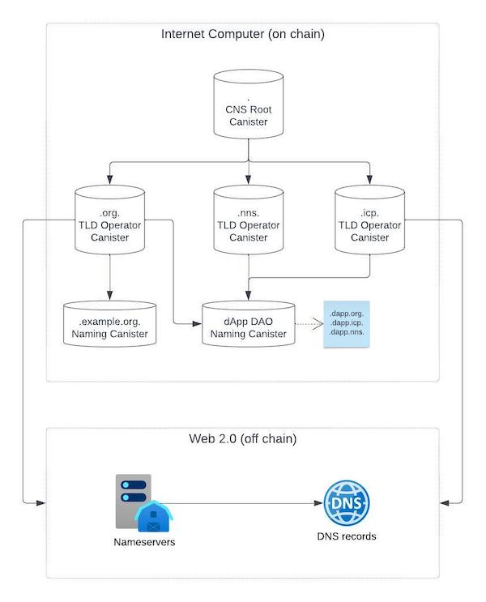

> This system is still a work in progress and should only be used for development purposes.

# Chain Name System

## Table of Contents

- [Overview](#overview)
  - [Motivation and Goals](#motivation-and-goals)
  - [High Level Architecture](#high-level-architecture)
    - [Terms and Definitions](#terms-and-definitions)
    - [System Design](#system-design)
- [Packages](#packages)
- [Getting Started](#getting-started)
  - [Who should be using this code](#who-should-be-using-this-code)
  - [Requirements](#requirements)
  - [Building the code](#building-the-code)
- [Contributing](#contributing)
- [Connect with the community](#connect-with-the-community)
  - [Working Group](#working-group)
  - [Developer Forum Thread](#developer-forum-thread)
  - [Developer Discord](#developer-discord)
- [Licensing](#licensing)
- [Show your support](#show-your-support)

## Overview

**Chain Name System (CNS)** is a decentralized, trustless discovery layer built directly on the Internet Computer. Aimed at reinventing the traditional Domain Name System (DNS), CNS leverages the power of canisters to enhance Internet infrastructure.

Unlike DNS which relies on centrally managed root name servers, CNS utilizes a root canister, essentially decentralizing the domain management system. This approach enhances the reliability, autonomy, and democratic nature of domain management, empowering the community through a system of elected operators who oversee top-level domains.

CNS is not just an alternative, but a forward-looking solution bringing about fair and community-centric Internet governance.

### Motivation and Goals

- Enable users to host their domain records in a registry that is on chain in a verifiable manner.

- Decentralize the domain name system with top level domains (TLDs) owned by multiple operators elected by the community.

- Provide services for users and decentralized autonomous organizations (DAOs) to register new domains and acquire full ownership of them.

- Provide a platform for decentralized applications.

### High Level Architecture

Ultimately CNS provides a complete name system solution on chain that is responsible for translating human-readable domain names to the respective IP addresses, dApp canister IDs, wallet addresses and others.

On-chain, it consists of three main components (naming, operator and root canisters) that work together to provide this functionality and its root is a canister governened by a decentralized autonomous organization (DAO).

Off-chain it leverages the CNS resolver to provide a simple interface for users to interact with the system. The resolver will facilitate client-side libraries that can be used by applications to resolve names to their respective records in a verifiable manner.

#### Terms and Definitions

- **Naming Canister:** A canister that holds domain records and has a standardized interface for managing and retrieving them.

- **TLD Operator:** The Top-level domain operator uses the naming canister or implements its own canister that is compliant with the Naming Canister interface to control the domain records of a Top-level domain. It exposes an interface that enables new domain registration.

- **CNS Root:** The CNS Root is a canister deployed to a system subnet and controlled by the NNS that acts as a registry for domain records and maps the ownership of Top-level domains to their operators. It exposes an interface that enables Web 2 TLD Operators to claim ownership over their Web 3 counterpart.

- **CNS Resolver:** A resolver that starts at the CNS Root to resolve a domain name and verifies the response.

#### System Design

## Packages

This repository is a monorepo that contains multiple packages and canisters under the [packages](./packages) and [canisters](./canisters) folders. Together they create the building blocks for the Chain Name System.

| Package             | Links                                                                                                | Description                                                                                                                                                                                    |
| ------------------- | ---------------------------------------------------------------------------------------------------- | ---------------------------------------------------------------------------------------------------------------------------------------------------------------------------------------------- |
| `cns-name-registry` |  | The `cns-name-registry` contains a set of core interfaces that enable the management and retrieval of name records.                                                                            |
| `cns-operator`      |       | A canister that builds on top of the `cns-name-registry` adding operator-like functionallity such as registering a new domain name.                                                            |
| `cns-root`          |           | The root canister of CNS, all name lookups start from as it. Its the replacement for the root name servers, a superset of the `cns-name-registry` that manages the top level domain namespace. |

## Getting Started

### Who should be using this code

- **If you are an owner of a domain name** and want to host your domain records on chain, consider using the [naming canister](./packages/cns-naming-canister/) to manage your domain records.
- **If you are or want to be a top level domain operator**, and want to manage that under the Chain Name System, you need to deploy the [operator canister](./packages/cns-operator-canister/) to manage your top level domain.
- **If you are an engineer looking to contribute to the CNS**, and want to understand how the system works, you should follow the [contribution guidelines](./.github/CONTRIBUTING.md).

### Requirements

Please make sure you have the following installed:

- [Rust](https://www.rust-lang.org/learn/get-started)
- [DFX](https://internetcomputer.org/docs/current/developer-docs/setup/install)

### Building the Code

Detailed instructions for building the code will be added soon.

## Contributing

Check out our [contribution guidelines](./.github/CONTRIBUTING.md).

## Connect with the community

We provide different platforms for you to engage with our community and the contributors behind Chain Name System (CNS). Here are the ways you can connect with us:

### Working Group

Be part of our naming system working group and join the meetings. Its a space where we brainstorm, share ideas and collaboratively make decisions that shape the future of CNS and the naming system.

### Developer Forum Thread

Have queries or suggestions? Want to discuss something with our wider community? Jump into our [Developer Forum Thread](https://forum.dfinity.org/t/technical-working-group-naming-system/21236) and start a conversation!

### Developer Discord

Prefer real-time chat? Join us on [discord](https://discord.com/channels/748416164832608337/1126922188742729948) in the naming system channel. We're always around to chat, answer your questions, and engage in lively discussions.

We look forward to hearing from you!

## Licensing

This project is licensed under the [Apache 2.0](./LICENSE) license.

## Show your support

If you find this project as exciting as we do, let us know by starring this repository ⭐️! Your support encourages us to keep innovating and striving for a decentralized name system.
